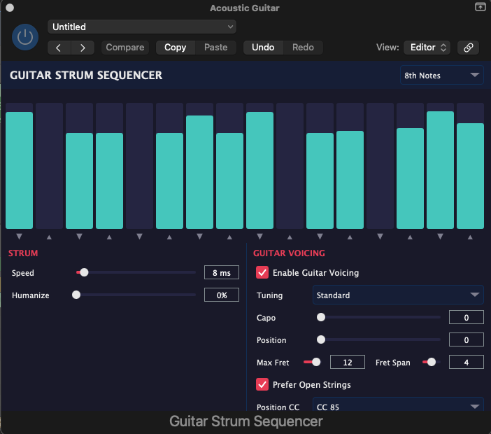

# Guitar Strum Sequencer

A JUCE-based MIDI FX plugin that turns held chords into realistic guitar strumming patterns. Available as AU and VST3.



## Features

- **16-Step Sequencer** — Per-step velocity control with adjustable subdivision (8th / 16th notes)
- **Auto Strum Direction** — Even steps strum down (low to high), odd steps strum up (high to low)
- **Guitar Voicing Engine** — Revoices keyboard chords into playable guitar fingerings across 6 strings
  - Exhaustive search with scoring system (pitch coverage, root in bass, fret span, open strings, etc.)
  - Automatic position tracking with proximity-based search
  - 5 tunings: Standard, Drop D, Open G, DADGAD, Half Step Down
  - Capo support (0–12)
  - Configurable fret span, max fret, and search range
  - CC-based position override
- **Strum Speed** — Adjustable inter-string delay (5–50 ms)
- **Humanize** — Velocity variation, per-note timing jitter, and global step timing offset
- **Multi-Channel Output** — Optional per-string MIDI channel assignment (for multi-sample guitar libraries)
- **Logic Pro Compatible** — Handles late MIDI delivery and CC#120 when track is selected

## Installation

### Pre-built (macOS)

Copy from the `Release/` folder to your system plugin directories:

```bash
# AU
cp -R "Release/Guitar Strum Sequencer.component" ~/Library/Audio/Plug-Ins/Components/

# VST3
cp -R "Release/Guitar Strum Sequencer.vst3" ~/Library/Audio/Plug-Ins/VST3/
```

Then rescan plugins in your DAW.

### Build from Source

Requirements: CMake, C++17 compiler (Xcode CLT on macOS)

```bash
# Clone JUCE into the project directory
git clone --depth 1 https://github.com/juce-framework/JUCE.git

# Build
cmake -B build -DCMAKE_BUILD_TYPE=Release
cmake --build build --config Release
```

Built plugins will be in `build/GuitarStrumSequencer_artefacts/Release/`.

## Parameters

| Parameter | Range | Default | Description |
|-----------|-------|---------|-------------|
| Subdivision | 8th / 16th | 8th | Step grid resolution |
| Strum Speed | 5–50 ms | 8 | Delay between each string |
| Humanize | 0–100% | 0 | Velocity and timing randomization |
| Guitar Voicing | on/off | on | Enable chord revoicing |
| Tuning | 5 options | Standard | Guitar tuning |
| Capo | 0–12 | 0 | Capo fret position |
| Position | 0–12 | 0 | Starting fret position for voicing search |
| Max Fret | 5–15 | 12 | Highest fret to consider |
| Fret Span | 3–5 | 4 | Max fret stretch for a voicing |
| Prefer Open Strings | on/off | on | Bonus score for open strings |
| Position CC | CC 85–106 | CC 85 | MIDI CC for real-time position override |
| Search Range | 2–7 | 5 | Fret positions to search around current position |
| Multi-Channel | on/off | off | Assign each string to a separate MIDI channel |
| Steps 1–16 | 0–127 | pattern | Per-step velocity (0 = silent/ghost) |

## Usage

1. Insert as a **MIDI FX** plugin on an instrument track
2. Hold a chord on your MIDI controller or piano roll
3. Press play — the sequencer will strum the chord following the step pattern
4. Adjust step velocities by dragging the bars in the GUI
5. Enable **Guitar Voicing** for realistic fingerings instead of raw keyboard notes

## License

MIT
